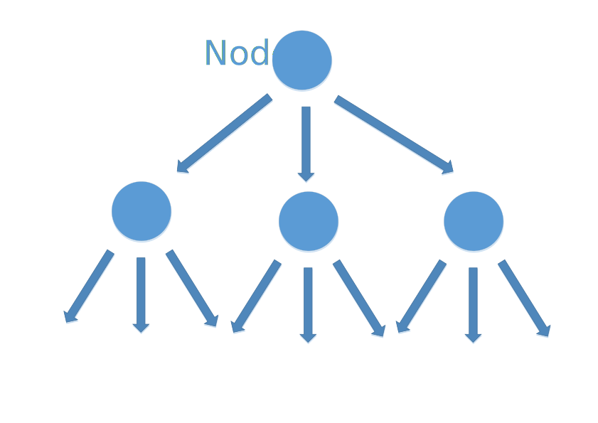
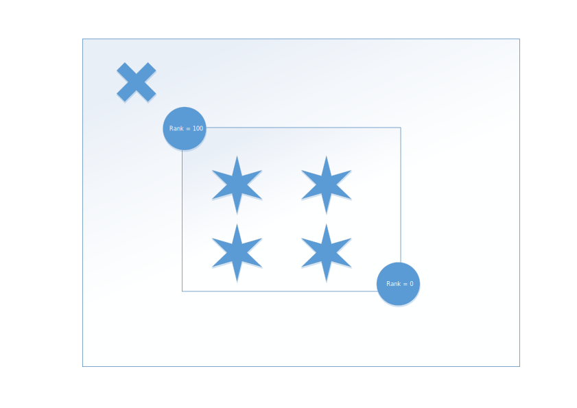
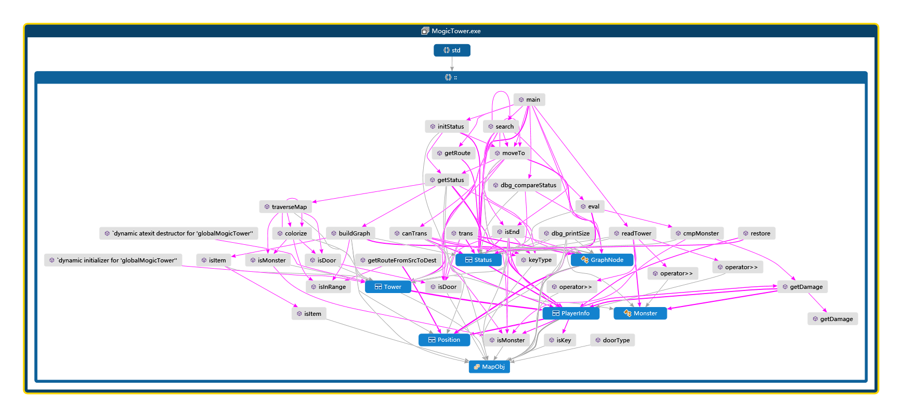

# 魔塔游戏AI设计的基本思路与实现

## 魔塔游戏AI设计的基本要求

魔塔游戏是一个较为著名的策略类RPG小游戏，通过操纵一名勇士，拾取给定地图上的包括血瓶、钥匙等在内的特殊道具，主动与怪物进行战斗和使用钥匙进行开门，最终目的是战胜整座塔的boss。


经过分析，我们觉得需要额外注意处理的地方有如下几点：

- 钥匙是具有很大作用的道具，当没有并且已经无法继续获得足够钥匙时游戏可能会无法继续
- 不同的门需要对应颜色的钥匙方可开启，需要对不同的钥匙分开记录
- 勇士可以通过选择一些增益效果来弥补经过这条路所受到的损失
- 完全连通的部分内部的周游是没有代价的，所以可以将部分类似的块合并处理以简化路径选择过程

根据评判标准，可能存在路线无法战胜boss从而选择较为优秀方法的情况，所以我们考虑使用将地图抽象为类似树结构的方式进行搜索，在限制的时间与空间内停止搜索返回当前的最优解。

类似于以前编写过的黑白棋、Pacman游戏AI，在搜索上继承了深度优先搜索并回溯，在同一层上利用广度优先搜索来对图进行重构，更加具体的内容将会在后文详细介绍。


我们还在游戏过程中总结出这样一些规律。

例如，我们在很大几率上遇到了某个连通块，它被墙壁包裹着，只有一个门（可能包含门附近的怪物），但是该连通块内部又有着较为丰富的增益效果。这种情况下我们应当进行评估，然后大多情况下选择进入该块的决定。在实际AI设计中，我们也希望这种思想能够在AI中实现，所以在设计评估函数时我们对这种情况进行了特殊的处理：通过内部增益块的权重的合理设置来抵消由于进入这个过程所引发的减益效果以及进入一个连通分量减少区域带来的负面影响。


简单来说，魔塔游戏AI的设计确实是一项艰巨而富有挑战性的任务，我们在进行建模、设计、具体实现以及参数调整过程中，也感受到了不同阶段的各种困难，在努力解决中也收获了很多。同时，非常感谢助教可视化程序的提供，这为我们在人脑选择可能较优路径与AI的转化之间提供了非常高效而且方便的工具，极大的加速了AI的设计与调试这一阶段的进度。

接下来我们将根据设计的时间顺序，就具体过程中遇到的问题与可能的解决方案展开叙述。

## 魔塔游戏AI设计的过程

###魔塔游戏AI设计的建模

首先最先完成的部分是魔塔地图部分的表达，这一部分是最为简单的部分。我们直接将勇士、怪物、塔与塔中的物体分别抽象为`Player`、`Monster`、`Tower`以及枚举类`MapObj`，并封装了`getDamage`函数，也为了输入的整洁性对流进行了重载，这是最开始对魔塔地图的表达。

对于图的表达是很轻松的完成了，但是最为关键的搜索部分应该采用怎样的数据结构的讨论花费了我们不少时间，我们在将搜索结构抽象为图还是树产生了比较大的分歧，最终我们选择了图作为每层搜索中的基础数据结构类型，在一层一层向下搜索与回溯过程中，利用树的性质，较为方便整洁的组织起了每一层之间的关系，大致结构如图：



我们考虑每一个`Node`，由于是搜索的过程，每一个`Node`都应该能够等价的表达当前整个图的状态，我们使用了这些成员来表达：

```cpp
/* 魔塔重构图节点结构 */
struct GraphNode
{
    bool valid;         /* 访问该节点后将valid设为false */
    Position pos;       /* 该节点的坐标 */
    MapObj type;        /* 该节点类型（门或怪物） */
    vector<GraphNode*> next; /* 子节点列表 */
    vector<MapObj> obj; /* 节点物品列表 */
    int blockCount;     /* 该节点增加的连通块计数 */
};

/* 状态转移结构 */
struct Status
{
    GraphNode* head;
    PlayerInfo player;
};
```

每个`status`利用一个`Status`的实例化对象等价表达，每个状态下，我们对局面所呈现的图进行节点重构，每一个静态状态地图中的每一个门或怪物节点都是树的组成部分。关于为什么只对门和怪物建树我们也经过了一番讨论，主要理由是大多数情况下，门和怪物节点才应该是决定连通分支数目的因素，将他们作为子节点插入到当前节点中，有利于使搜索过程更加高效。

### AI搜索算法的建立与完善

一开始我们先完成了一个较为简单的基于`bfs`的算法，采用队列，对当前节点所在整个封闭区域内进行搜索，以此来找出当前节点的每个`next`指针的位置，这里的`next`既包含`GraphNode`也包含`MapObj`，可以同时同步完成节点的添加过程，利用`vector`也是基于其高效的插入特性。

这个方案看似非常符合常理，但是在完成后我们突然想到了这样的情况，如图所示：



图中十字叉位置表达当前搜索到的节点，圆形表示一个怪物，其上`rank`值表示其生命值，也就是勇士攻击它而获得的损益效果，考虑离勇士很近的怪物拥有很高的生命值的情况，中间的星型表示许多增益效果。

如果采用上文所描述的广度优先搜索的方式进行搜索，我们会自然的将中间的增益效果归为高`rank`的怪物所有，所以我们会评估增益效果与这个高`rank`的损益，从而做出要么不取要么通过高`rank`怪物得到增益，而显然地，我们本可以经过那个稍远的怪物获得这些增益，这样的代价明显是更小的，但是上文描述的广度优先搜索无法对这种情况做出很好的计算结果，而在实际中这种情况出现的概率并不能达到被忽略的地步，所以我们只好做出修改核心搜索算法的选择。


我们尝试使用图染色的基本思路来处理这里的问题，因为在这个情景中，连通这一条件与增益的获得有着必然的联系。我们最终针对单层局面的搜索函数如下：

```cpp
static void colorize(const Tower& mogicTower, int x, int y, 
                     const int color, int been[MAP_LENGTH][MAP_WIDTH])
{
    if (been[x][y] != 0)
        return;
    auto& map = mogicTower.mapContent;
    been[x][y] = color;
    for (int i = 0; i < 4; i++)
    {
        int nx = x + dx[i];
        int ny = y + dy[i];
        if (!isInRange(nx, ny))
            continue;
        if (map[nx][ny] == wall)
            continue;
        if (isMonster(mogicTower, nx, ny))
            continue;
        if (isDoor(mogicTower, nx, ny))
            continue;
        colorize(mogicTower, nx, ny, color, been);
    }
}

static void traverseMap(const Tower& mogicTower, 
                        GraphNode* cur, int been[MAP_LENGTH][MAP_WIDTH])
{
    int color = 0;
    auto& map = mogicTower.mapContent;
    for (int i = 0; i < MAP_LENGTH; ++i)
        for (int j = 0; j < MAP_WIDTH; ++j)
        {
            if (map[i][j] == wall)
                continue;
            if (been[i][j] != 0)
                continue;
            if (isMonster(mogicTower, i, j) || isDoor(mogicTower, i, j))
            {
                been[i][j] = ++color;
                continue;
            }
            colorize(mogicTower, i, j, ++color, been);
        }
}
```

通过两种不同类型的染色形式，对当前的局面进行了较为准确而快速的量化，最终对于单层中的连通分量，我们取得了较好的计算方式。


通过上述操作，我们得到了染色后的地图，也就是代码中的`been`数组，然后根据`been`数组建立上文提到的后继节点关系，具体代码实现在`buildGraph`函数中，唯一需要指出的是，为了搜索的方便，将容器由`vector`改为`set`，具体代码因较长不在此列出。

到这里我们得到了每个`status`对应的等价图关系，这为我们深度优先搜索以及回溯提供了基础。

### 深度优先搜索算法的具体实现

根据深度优先搜索算法的实现过程，大致可以分成这样几个部分：

```
if(depth == MAX_DEPTH)
	return eval;

backup();
for(every_next_status)
{
  	try();
  	if(curVal > maxVal)
  		maxVal = curVal;
  	restore();
}
```

在我们进行上述构造并搜索时，在可接受的时间范围内对第一个输入大概只能搜索到4-5层，虽然这样可以解决前3个例子，但是最终只能达到4-5层并不是一个非常好的深度。为了找到代码中最为耗时的部分，我们使用`Visual Studio`的调试工具对代码进行了性能分析，最终发现`backup`与`restore`部分占用了过多的时间，究其原因，我们推测是在复制的时候对于指针的处理过于复杂。

为了能够让搜索算法的效果有质的提升，必须要对指针复制中大量的资源占用做出优化，我们无奈之中只能对整个图节点结构进行重构，重构的目的是优化指针操作，我们改用记录`index`值的方式，并因此修改了几乎整个项目，这次重构是整个过程中最为耗时的部分。

```cpp
/* 魔塔重构图节点结构 */
class GraphNode
{
private:
    int index;              /* 该节点索引值（最初被染的颜色） */
    Position pos;           /* 该节点的坐标 */
    MapObj type;            /* 该节点类型 */
    
public:
    bool empty;             /* 访问该节点后将empty设为true */
    int blockCount;         /* 该节点增加的连通块计数 */
    set<int> adj;           /* 邻接节点索引列表 */
    vector<MapObj> obj;     /* 节点物品列表 */
    Status* fatherStat;

    //GraphNode() { empty = true; }
    GraphNode(Status* father = nullptr): empty(true), fatherStat(father) {}
    GraphNode(Status* father, int _idx, int _x, int _y, MapObj _type):
    fatherStat(father), index(_idx),  pos(_x, _y), type(_type), empty(false), blockCount(1) {}
    MapObj getType()const { return type; }
    int getIndex()const { return index; }
    const Position& getPos()const { return pos; }
    bool operator==(const GraphNode& o)const;
};
/* 状态转移结构 */
struct Status
{
    int curIdx;
    PlayerInfo player;

    vector<GraphNode> nodeContainer;

    Status(): curIdx(0), player(), nodeContainer() {}
    Status(const Status& other);
    const Status& operator=(const Status& other);
    GraphNode& getNode(int index = 0) { return index ? nodeContainer[index] : nodeContainer[curIdx]; }
    const GraphNode& getNode(int index = 0)const { return index ? nodeContainer[index] : nodeContainer[curIdx]; }
    GraphNode* getNodePtr(int index = 0) { return index ? &nodeContainer[index] : &nodeContainer[curIdx]; }
};
```

重构后性能有了巨大的提升，若以第一个输入为例，每次搜索8层可以在1秒内出解，达到了预期要求。


最终我们主函数逻辑可作如下图，从图来看还是很错综复杂的，应该有优化的空间：




## AI设计过程所遇到困难及解决方案

### 状态的表达与快速操作

在一开始构建`status`类的目的是用来完整的等价表达当前的状态，以期能够在尽量减少图的重构操作的同时保证搜索的有效与准确，该如何完整的表达状态是我们遇到的第一个问题。本质上来说，这跟上学期程序设计实习中提到的深拷贝与浅拷贝有类似之处。经过了上述的思考与讨论过程，我们最终选用了存`index`的方案，达到了速度与检索方便程度的统一。

### 评估函数与终止判断

评估函数是对抗类AI设计的核心内容，也是竞争力的体现，我们对于每一个独立的`status`进行了评估，评估考虑的对象以当前状态的人物为主，考虑了包括生命值、攻击力、防御力、钥匙等在内的许多元素。计划中加入一些能表达此处连通情况的权值，但是不能保证一定能对估值有正影响，所以暂时没有考虑加入进来。

每次判断是否结束时，我们当前采用的方案是判断在当前连通分支中，是否有可以继续占据的怪物或者门，但是这样的判断是有问题的。最关键的问题是，如果当前可以通过占据一个怪物来拓展连通分支，并且这一条新的连通分支背后可能意味着更多的收益，从而使得最终收益增大，这是无法通过判断结束来解决的。同时，判断是否结束的函数是每一层搜索的每一步都需要调用一次，所以时间消耗不允许过大。最终我们仅仅在其中实现遍历所有邻接节点，速度有所提升。

### 记录并输出路径

这一部分的调试也占用了很多时间，原因在于在某一连通块之中如何进行遍历，因为我们所记录的信息并不足以进行一次有序的遍历。对于每个`status`，我们只记录了与其连通的门或者怪物，而对于连通区域内部所有增益效果块均可以无损益获取。所以我们先写了一个求两点之间路径的函数，通过宽搜实现，接着枚举连通块内增益点，按距离长短依次访问，并标记，最终得到一条路径。

## AI性能分析

当前我们对于给定的7组数据有如下结果：

|  组别  |  结果  |
| :--: | :--: |
|  1   |      |
|  2   |      |
|  3   |      |
|  4   |      |
|  5   |      |
|  6   |      |
|  7   |      |

### 不足之处


## AI设计过程中的亮点

### 版本控制工具的使用

AI设计大作业的完成是一项相互合作，各取所长的过程，同时由于客观时间原因，不太可能抽出很多时间大家坐在一起同时完成某项功能，只能讲其按模块分开完成，这对各部分与接口之间的统一性提出了要求。我们先对整体的几个表达图与搜索过程的关键定义与函数进行了讨论，得出了较为统一的意见，在后来的实现过程中尽量减少对其的更改，在无法避免的情况下再进行大型重构。

为了便于版本控制与协作，我们利用了[Github](https://github.com)作为同步与版本控制工具，下图是某个集中开发的周末的`commit`的记录截图：


通过`git`的使用，方便了组同学内部的交流，也便于出现巨大问题时迅速恢复。


### 对工程项目文件组织形式的优化

为了更好的体现`C++`面向对象的特点，增加工程项目文件的可读性，我们对于项目文件的组织进行了调整。

我们首先将所有基础类的定义从主函数中抽离出去，并以`*.h`的形式声明，在对应的`*.cpp`中实现函数的定义。接着对于一些常用的函数进行了重新包装以提高重用性。


### 对高效的C++特性的利用

我们也力图通过尝试`C++`的特性来实现部分内容的简化。尽管这些内容可能在课堂上不会作为要点教授，但是我们觉得这些的学习与使用，才是本门课程中**实习**二字的意义所在。


### 严谨的调试

为了提高调试的效率，尽可能缩短达到理想效果的时间，我们单独定义了一系列供调试使用的宏、函数，加入了一系列异常处理，从而更好的处理了一些可能出现的偶然错误。


## 其他说明

###参考资料

除了魔塔本身游戏的基本规则外，没有参考任何资料。

对魔塔游戏的理解全部来源于我们手动玩魔塔游戏的经验，游戏中的算法均为独立构思，未参考任何代码。